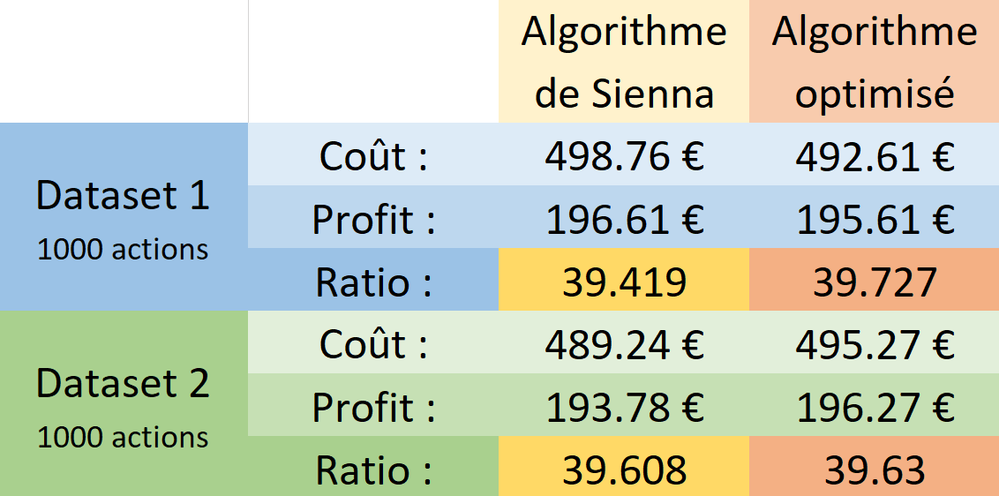

# 
<bold>AlgoInvestor - OCR_Mission[6]</bold>

=========================================================================

   
  <picture> 
    
  </picture>
   
   

### 
- Algorithmes pour la décision d'investissements financiers -

# 
 I. Description du Projet

Il nous a été demandé d'implémenter en python des algorithmes pour la sélection d'actions (avec coût et rendement) dans le but de maximiser le rendement d'un investissement tout en respectant une contrainte de budget de 500€.
Le but était de comprendre la complexité Big(O) et sa dimension cruciale pour la scalabilité. Nous étions aussi challengés sur la performance de nos résultats en comparaison avec des résultats de référence passés du "client" (challenge ayant motivé le tweaking de notre algorithme optimisé)

Le premier algorithme est une solution bruteforce. Il :

- lit les données d'un fichier texte fourni (Datas/actions.txt) et convertit ces données en une liste de listes, où chaque sous-liste représente une action avec ses caractéristiques : nom, coût (en euros), rendement (en pourcentage du coût).
- génère ensuite toutes les combinaisons possibles d'actions (ou "`shares_pack`") qui respectent la contrainte de budget de 500€ en utilisant la récursivité 
- compare enfin les rendements et retient la combinaison d'actions ayant le meilleur rendement.

Le second algorithme est une solution optimisée de type "algorithme glouton" tweaké pour être optimimal sur les datasets fournis (datasets1 et dataset2, incluant des données érronées pour nécessiter un "cleaning") dont la taille rendait le traitement par bruteforce matériellement impossible (1000 actions...). Il :

- lit les données d'un des fichiers csv fourni (Datas/dataset*.csv) et convertit ces données en une liste de listes, où chaque sous-liste représente une action avec ses caractéristiques : nom, coût (en euros), rendement (en pourcentage du coût).
- nettoie le dataset (retire la ligne de titre, les actions au coût ou au rendement ≤ 0).
- effectue un tri sur la liste en fonction du rendement, un filtrage des actions pour optimiser les résultats, une sélection des actions dans l'ordre du tri et un calcul du rendement du portefeuille d'action.

Alors que la complexité de l'algorithme bruteforce est d'ordre exponentiel de type O(2^n^ * `n`), celle de l'algorithme optimisé est d'ordre linéarithmique de type O(`n` log `n`), assurant sa scalabilité pour le traitement d'un nombre important de données

# 
 II. Comparatifs de complexité force brute & optimisé

     
    <picture>
        
    </picture>

# 
 III. Comparatif des résultats : solution optimisée / solution "client" (Sienna)

     
    <picture>
        
    </picture>

------------------------------------------

## 
I - Setup windows

#### ( si [Git](https://github.com/git-for-windows/git/releases/download/v2.45.0.windows.1/Git-2.45.0-64-bit.exe) et [python 3.6+](https://www.python.org/ftp/python/3.12.3/python-3.12.3-amd64.exe) ne sont pas installés, commencez par l'annexe 1 !)
------------------------------------------
  #### A - Créez un répertoire pour le programme
Lancez votre explorateur windows (WIN+E) 
Créez un répertoire (CTRL+MAJ+N) pour le programme où vous le souhaitez et **nommez-le**
ex. : vous pouvez l'appeler **AlgoInvestor** dans d:\chemin\vers\mon\dossier\AlgoInvestor
**double-cliquez** sur le répertoire créé pour aller dedans.

  #### B - lancez l'interpréteur de commande windows
Clic gauche dans la barre d'adresse de l'explorateur, écrivez **"cmd"** (à la place de l'adresse)
et appuyez sur **"entrée"** (comme à chaque instruction en ligne future):

	cmd
	
  #### C - clonez le repo Github du projet dans ce répertoire
dans le terminal (l'invite de commande) qui indique bien que vous êtes à l'adresse du dossier créé, écrivez tour à tour:

	git init

puis : 

	git pull https://github.com/AdeVedA/AlgoInvestor--OCR_Mission6 -t main

 
  #### D - Lancement du programme :

	python bruteforce.py

ou bien

	python optimized.py

-------------------------
-------------------------

## 
II - Setup Linux/Mac

#### ( si **[Git](https://sourceforge.net/projects/git-osx-installer/files/git-2.23.0-intel-universal-mavericks.dmg/download?use_mirror=autoselect)** et **[python](https://www.python.org/ftp/python/3.12.3/python-3.12.3-macos11.pkg)** ne sont pas installés, commencez par l'annexe 1 !)

-------------------------
	
  #### A- lancez un terminal

clic sur loupe/recherche lancez

	terminal
	
  #### B - Créez un répertoire pour le programme et placez-vous dedans
  par exemple si vous souhaitez appeler ce dossier "AlgoInvestor" :

	mkdir AlgoInvestor

puis :

	cd AlgoInvestor

  #### C - clonez le repo Github du projet dans ce répertoire
dans le terminal (l'invite de commande) qui indique bien que vous êtes à l'adresse du dossier créé, écrivez tour à tour:

	git init

puis : 

	git pull https://github.com/AdeVedA/AlgoInvestor--OCR_Mission6 -t main

  #### D - Lancement du programme:

	python3 bruteforce.py

ou bien

	python3 optimized.py

## 
III - informations sur la structure de données

les données de vos tournois et joueurs sont toutes sauvegardées en .json dans le répertoire "datas" et le sous-répertoire "tournaments"

	racine_projet/
		├─────datas/
		├	   ├────dataset1_Python+P7.csv
		├	   ├────dataset2_Python+P7.csv
		├	   └────...
		├─────bruteforce.py
		└─────optimized.py

# 
Annexe 1 - installation de Python & Git

=======================================================================

pour Windows 64bits :
--------------------

installez **[Git](https://github.com/git-for-windows/git/releases/download/v2.45.0.windows.1/Git-2.45.0-64-bit.exe)** 
verifiez en tapant "cmd" dans le menu démarrer puis "git version" dans le terminal

installez **[python](https://www.python.org/ftp/python/3.12.3/python-3.12.3-amd64.exe)** en vous assurant que ***"Add to PATH"*** est coché (laissez les autres choix par défaut)
verifiez en tapant "cmd" dans le menu démarrer puis "python --version" dans le terminal

pour Mac/Linux :
--------------------
**Git**
cliquez sur l'icone de recherche (loupe), écrivez "terminal" (on vérifie si git est déjà présent)

	git version

si ok, passez à python. 
sinon, installez ce qu'il vous propose d'installer ("command line developer tools") puis recommencez "git version" en terminal,
sinon : installez **[Git](https://sourceforge.net/projects/git-osx-installer/files/git-2.23.0-intel-universal-mavericks.dmg/download?use_mirror=autoselect)**
puis revérifiez git version dans le terminal

**Python**
installez **[python](https://www.python.org/ftp/python/3.12.3/python-3.12.3-macos11.pkg)**
